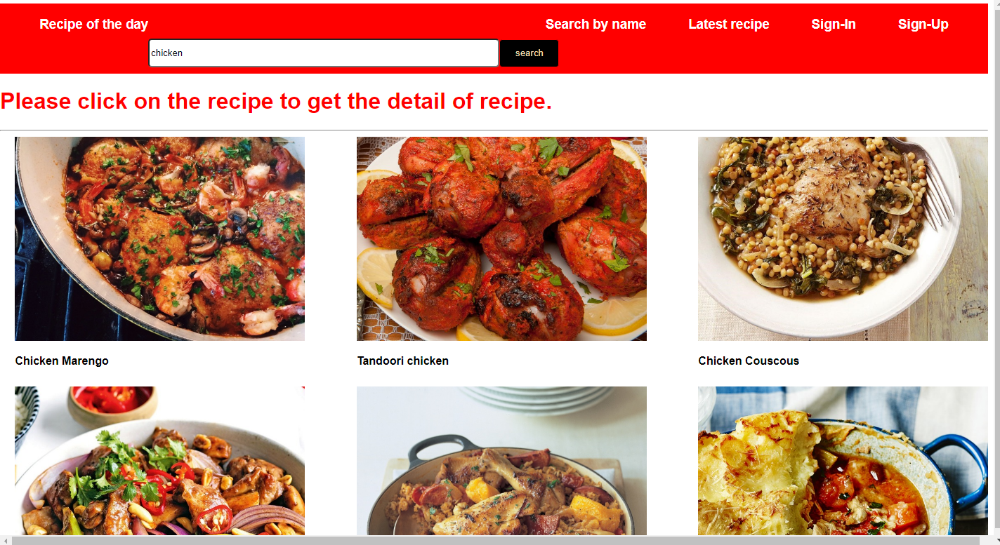
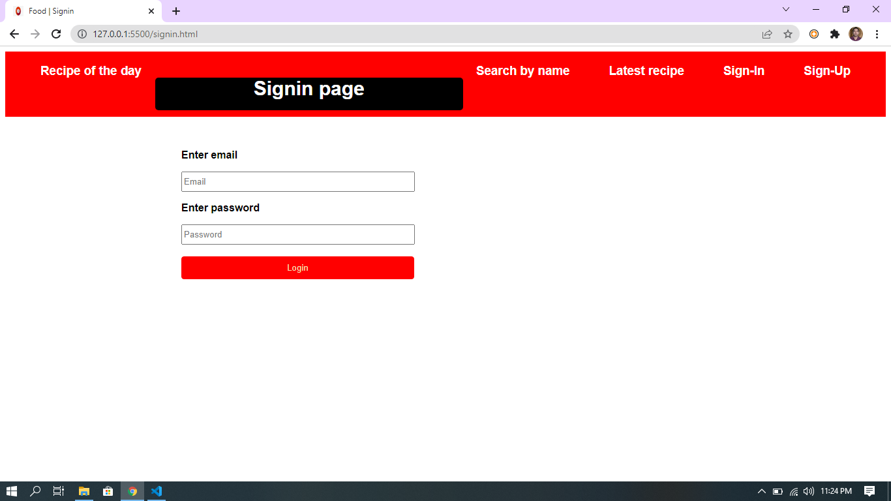
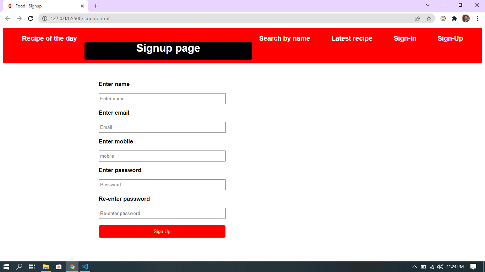
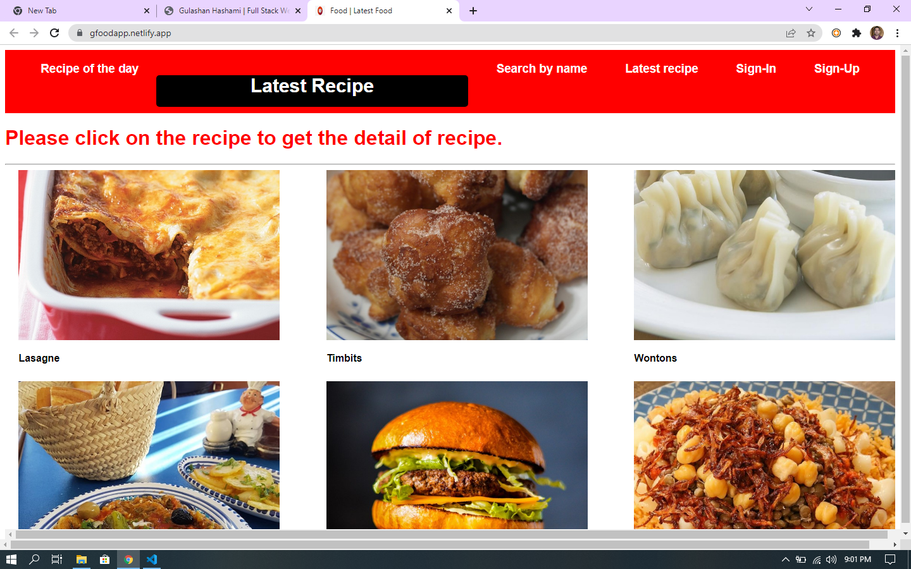
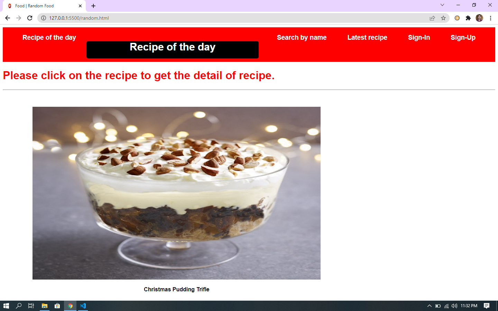
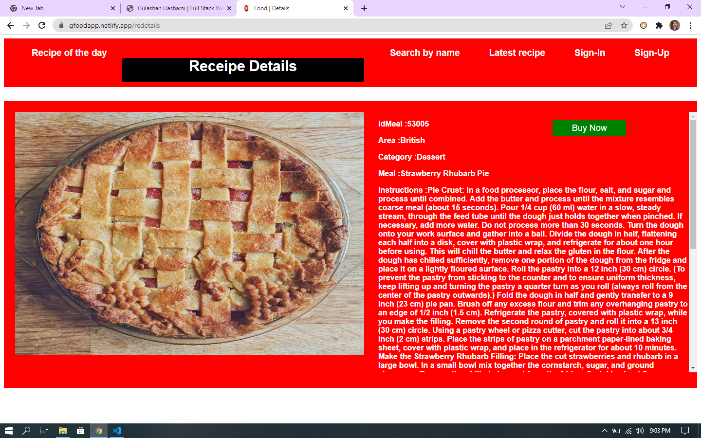
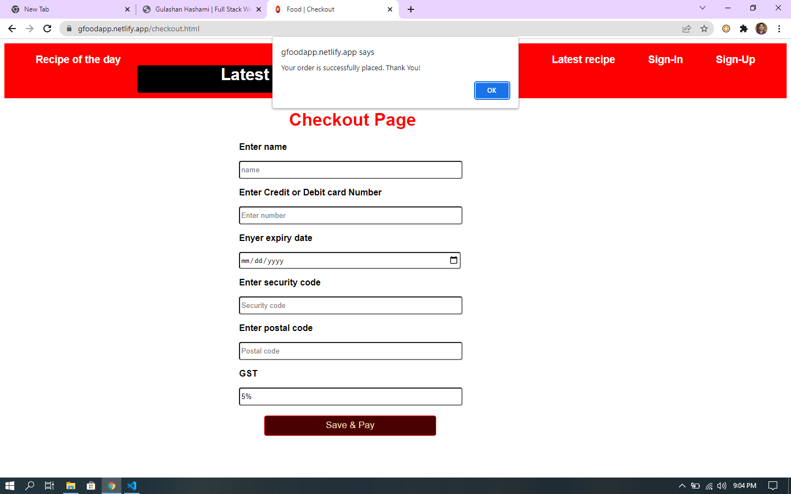

# Food_App

---

## This is a mini food app created by me. Here you can see latest food, food of the day. And you can search any food.

# Author

- [Gulashan Hashami ](https://github.com/gulashanhashami)

# Prerequisities

- HTML
- JavaScipt
- DOM
- CSS
- API

# Run Locally

- To run this project locally follow following steps below
- Create folder in your local system

Clone this Project

`git pull https://github.com/gulashanhashami/Food_App.git`

- Now the project is ready just go and visit home page

# Screenshots

> HOME PAGE

> SIGNUP PAGE

> LOGIN PAGE

> LATEST FOOD PAGE

> THE DAY OF FOOD PAGE

> RECIPE DETAILS PAGE

> PAYMENT PAGE

# What did I Learn

- By end of this project, I am able to learn how effective work can be done as a solo when ideas are trajected in multiple spectrums.

- I learn many things includes, creating dynamic web page, map product data to show on web page and use API for product data.

- Effective learning involves how we were able to suggest constructive feedback on each other’s work and debug before we present our project.
